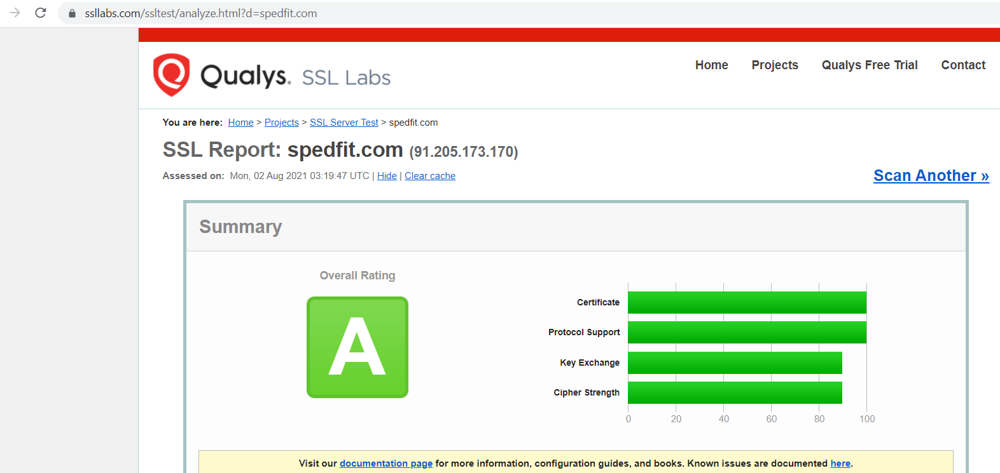

# Step-1: DNS Record check
> NS Record set & DNS Propagation check, A record Check
> `https://dnsmap.io/#A/spedfit.com` or `https://dnschecker.org/#A/www.spedfit.com`


### Note
> If you find the IP of the server from the search above, then you are ready to go to the next step.

# Step-2: NGINX
### Virtual Hosting using nginx
> `nano /etc/nginx/conf.d/spedfit.com.conf`

```
server {
        listen 80;
        server_name spedfit.com;
	#expires 1d;

	location / {

          #proxy_cache my_cache;
	  #proxy_buffering        on;
	  #proxy_cache_valid      200  1d;
	  #proxy_cache_use_stale  error timeout invalid_header updating
          #http_500 http_502 http_503 http_504;

          proxy_set_header X-Forwarded-For $proxy_add_x_forwarded_for;
          proxy_set_header X-Forwarded-Proto $scheme;
          proxy_set_header X-Real-IP $remote_addr;
	  proxy_set_header Host $host;
          proxy_pass  http://127.0.0.1:8822;
        }
}
```


## NGINX STATUS & RESTART
> sudo systemctl status nginx\
> sudo systemctl reload nginx\
> sudo systemctl restart nginx

## NGINX Configuration check
> sudo nginx -t

## Upload website/webapp files to the remote server
> windows: using winscp\
> linux: using ssh scp command

# Creating a Systemd service file
> sudo nano /lib/systemd/system/spedfit.service

```
[Unit]
Description=Spedfit website
After=network.target

[Service]
Type=simple
Restart=always
RestartSec=5s
WorkingDirectory=/home/mastererp/spedfit.com/
ExecStart=/home/mastererp/spedfit.com/spedfit

[Install]
WantedBy=multi-user.target
```

## Set permission
> sudo chmod 664 /lib/systemd/system/spedfit.service

## Reload systemd daemon
> sudo systemctl daemon-reload

## Check service status & Restart (just created)
> sudo service spedfit status\
> sudo service spedfit start

## Enable to start services automatically at boot
> sudo systemctl enable spedfit

# Obtaining a certificate from letsencrypt.org
### Single domain registration
> sudo certbot --nginx -d spedfit.com -d www.spedfit.com

### Multiple domain registration
> sudo certbot --nginx -d spedfit.com -d www.spedfit.com

## To Test the certificate and SSL Configuration
> `https://www.ssllabs.com/ssltest/analyze.html?d=spedfit.com`



## Check out nginx spedfit.com.conf again (too verify what changes made after obtained ssl certificate)


# Renew SSL Certificate
> sudo certbot renew --dry-run

# Firewall open port & Reload
> sudo firewall-cmd --list-ports\
> sudo firewall-cmd --permanent --add-port=8822/tcp\
> sudo firewall-cmd --reload\
> sudo firewall-cmd --list-ports

## Set Execute permission to binary file
> sudo chmod +x /home/mastererp/spedfit.com/spedfit

## Change owner permission
> sudo chown -R root:root /home/mastererp/spedfit.com/


# Resource
* [NGINX digitalocean setup guide](https://www.digitalocean.com/community/tutorials/how-to-secure-nginx-with-let-s-encrypt-on-centos-8)
* [APACHE digitalocean setup guide](https://www.digitalocean.com/community/tutorials/how-to-secure-apache-with-let-s-encrypt-on-centos-8)